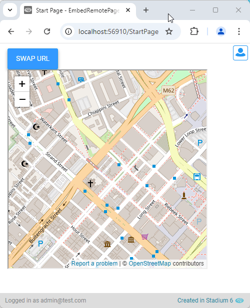
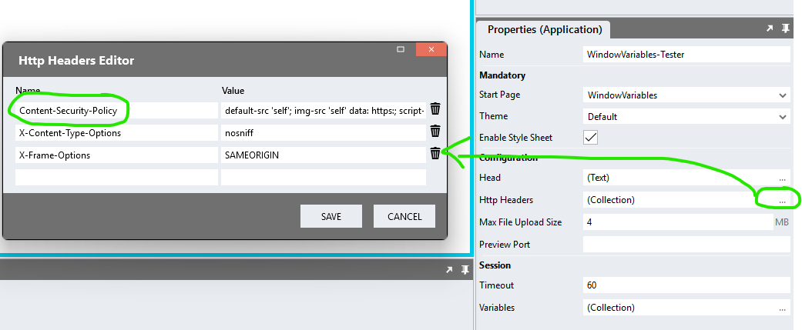
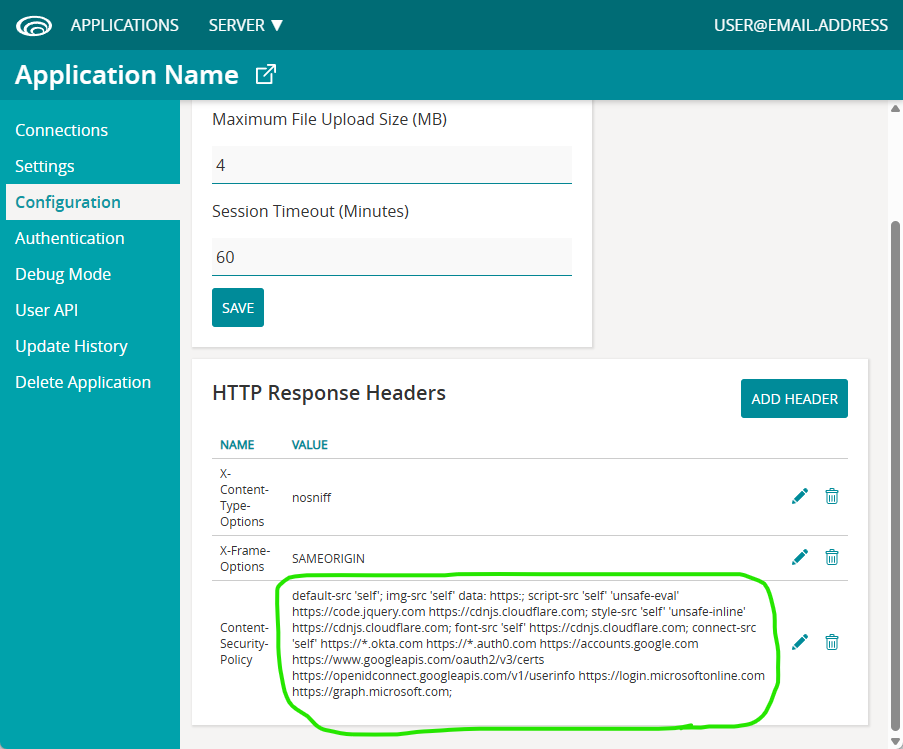

# Embed Remote Page

Embed a remote page in an iFrame on a Stadium page. When publishing an application, you may need to amend the application [Content Security Policy](#content-security-policy) to prevent external pages from being blocked. 



# Version
Initial 1.0

# Setup

## Application Setup
1. Check the *Enable Style Sheet* checkbox in the application properties

## Global Script
1. Create a Global Script called "EmbedRemotePage"
2. Add the input parameters below to the Global Script
   1. ContainerClass
   2. RemoteUrl
3. Drag a *JavaScript* action into the script
4. Add the Javascript below unchanged into the JavaScript code property
```javascript
/* Stadium Script v1.0 https://github.com/stadium-software/embed-remote-page */
let containerClass = ~.Parameters.Input.ContainerClass;
if (typeof containerClass == "undefined") {
    console.error("The ContainerClass parameter is required");
    return false;
}
let remoteUrl = ~.Parameters.Input.RemoteUrl;
if (typeof remoteUrl == "undefined" || !/https?:\/\/[-a-z0-9@:%._\+~#=]{1,256}\.[a-z0-9()]{1,6}\b([-a-z0-9()@:%_\+.~#?&//=]*)/i.test(remoteUrl)) {
    console.error("The RemoteUrl parameter must be a valid Url");
    return false;
}
let container = document.querySelectorAll("." + containerClass);
if (container.length == 0) {
    console.error("The class '" + containerClass + "' is not assigned to any Containers");
    return false;
} else if (container.length > 1) {
    console.error("The class '" + containerClass + "' is assigned to multiple Containers. Containers using this script must have unique classnames");
    return false;
}
container = container[0];
let ifrm = container.querySelector("iframe");
if (!ifrm) {
    ifrm = document.createElement("iframe");
}
ifrm.src = remoteUrl;
let compStyles = window.getComputedStyle(container);
let width = compStyles.getPropertyValue("width");
if (width == "0px") width = "400px";
let height = compStyles.getPropertyValue("height");
if (height == "0px") height = "400px";
ifrm.style.setProperty('width', width);
ifrm.style.setProperty('height', height);
container.appendChild(ifrm);
```

## Page
1. Drag a *Container* control to a page
2. Add a unique classname to the *Container* classes property (e.g. embedded-page-container)

## Event Handler
1. Drag the "EmbedRemotePage" script into an event handler or script
2. Enter values for the input parameters
   1. ContainerClass: The unique classname you assigned to the *Container* (e.g. embedded-page-container)
   2. RemoteUrl: The URL of the remote page you wish to embed (include http or https)

## CSS
Add a declaration in the application StyleSheet to specify the width and height for the embedded page. The default is 400px height and width. 

Example: 
```CSS
.embedded-page-container {
	height: calc(100vh - 150px);
	width: calc(100vw - 150px);
}
```

## Content Security Policy
In most cases, it is necessary to add an entry in the 'Content Security Policy' in the application 'HTTP Headers' to prevent external page downloads from being blocked in the browser. This can be achieved by adding an entry in the Application Properties in the Stadium Designer or in the Stadium Application Manager after publishing the application. 





The default configuration for the 'Content Security Policy' contains the entries below. To enable loading an external page in an iFrame, it is necessary to add "frame-src 'self'" and the url you wish to enable to this string. 

**Example for enabling PowerBI to load in an iFrame**

`default-src 'self'; img-src 'self' data: https:; script-src 'self' 'unsafe-eval' https://code.jquery.com https://cdnjs.cloudflare.com; style-src 'self' 'unsafe-inline' https://cdnjs.cloudflare.com; font-src 'self' https://cdnjs.cloudflare.com; connect-src 'self' https://*.okta.com https://*.auth0.com https://accounts.google.com https://www.googleapis.com/oauth2/v3/certs https://openidconnect.googleapis.com/v1/userinfo https://login.microsoftonline.com https://graph.microsoft.com; frame-src 'self' https://app.powerbi.com;`

## Working with Stadium Repos
Stadium Repos are not static. They change as additional features are added and bugs are fixed. Using the right method to work with Stadium Repos allows for upgrading them in a controlled manner. How to use and update application repos is described here 

[Working with Stadium Repos](https://github.com/stadium-software/samples-upgrading)